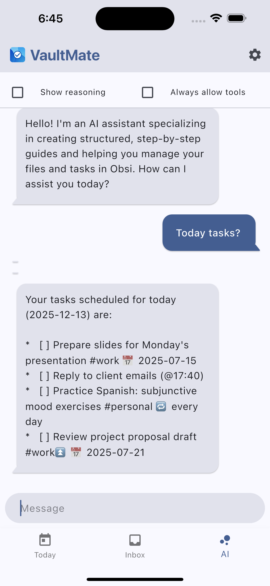

<div align="center">

# VaultMate 🛡️
### The Ultimate Mobile Companion for Obsidian

[](https://www.gnu.org/licenses/gpl-3.0)
[](https://flutter.dev)
[](https://play.google.com/store/apps/details?id=com.scanworks.obsi)
[](https://apps.apple.com/app/id6740782775)

<p align="center">
  <b>Manage tasks, edit notes, and track your habits directly from your Obsidian vault.</b><br>
  Local-first. Privacy-focused. Open Source.
</p>

</div>

---

## 📸 Screenshots

<div align="center">
  
  
  
</div>

---

## 🚀 Features

VaultMate fills the gap between a simple to-do app and the powerful Obsidian knowledge base.

* **⚡ Seamless Integration:** Works directly with your local markdown files. No proprietary database, no vendor lock-in.
* **✅ Advanced Task Management:**
    * Parse `- [ ]` tasks automatically from your notes.
    * Support for `#tags` and priorities.
    * Clean, mobile-optimized UI for checking off items.
* **🎨 Home Screen Widgets:** Interactive widgets for iOS and Android. View tasks and quick notes without opening the app.
* **🔌 Plugin Compatibility:** Fully compatible with Obsidian Tasks, NoteTask, and Reminder plugins.
* **🔒 Privacy First:** Your data never leaves your device (unless you sync via iCloud/FolderSync). No analytics, no tracking.
* **🌓 Dark Mode:** Fully optimized for late-night productivity.

---

## 📥 Download

| Platform | Status | Link |
| :--- | :--- | :--- |
| **Android** | ✅ Live | [Download on Google Play](https://play.google.com/store/apps/details?id=com.scanworks.obsi) |
| **iOS** | ⏳ In Review | [Download on App Store](https://apps.apple.com/app/id6740782775) |

*(iOS link will be active once approved by Apple)*

---

## 🛠️ Building from Source

If you are a developer and want to contribute or build it yourself:

1.  **Clone the repository:**
    ```bash
    git clone [https://github.com/vankir/VaultMate.git](https://github.com/vankir/VaultMate.git)
    cd VaultMate
    ```

2.  **Install dependencies:**
    ```bash
    flutter pub get
    ```

3.  **Run the app:**
    ```bash
    flutter run
    ```

*Note: For iOS, you will need a Mac with Xcode installed.*

---

## 🤝 Contributing

Contributions are welcome! If you have an idea for a feature or found a bug:

1.  Open an [Issue](https://github.com/vankir/VaultMate/issues) to discuss it.
2.  Fork the repository.
3.  Create your feature branch (`git checkout -b feature/AmazingFeature`).
4.  Commit your changes.
5.  Push to the branch.
6.  Open a Pull Request.

---

## 📄 License

This project is licensed under the **GNU GPLv3 License**. This means you are free to use and modify the code, but any derivative works distributed to the public must also be open source. See the [LICENSE](LICENSE) file for details.

---

<div align="center">
  Created with ❤️ for the Obsidian Community
</div>