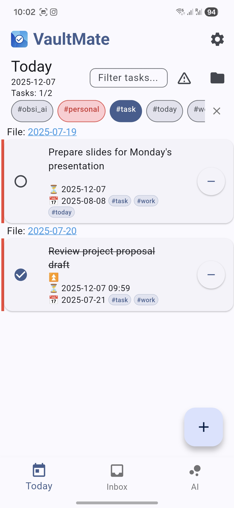
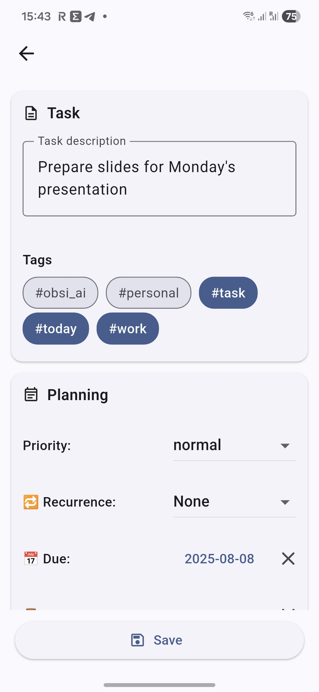

<div align="center">

# [MD Assistant 🛡️](https://github.com/dangehub/md-assistant)
### An Enhanced Android Companion for Obsidian

[](https://flutter.dev)
[](https://www.gnu.org/licenses/gpl-3.0)

<p align="center">
  <b>This project is a fork of <a href="https://github.com/vankir/VaultMate">VaultMate</a>, focused on advanced widget capabilities and enhanced task management workflows.</b><br>
  Local-first. Privacy-focused. Open Source.
</p>

</div>

---

## 🚀 Key Differences & New Features

MD Assistant builds upon the solid foundation of VaultMate with specific enhancements for power users:

### ✨ New Functionalities
*   **📝 Memos Widget**: A dedicated widget to view and quickly capture thoughts.
    *   **Quick Capture**: Tap `+` on the widget to open a lightweight, transparent input dialog without fully opening the app.
    *   **Auto-Timestamp**: Automatically appends entries with `- HH:mm Content` format to your daily note.
    *   **Smart Refresh**: Widget updates instantly after adding a memo.
    *   **Variable Support**: Support dynamic paths like `{{YYYY}}/{{YYYY-MM-DD}}.md`.
*   **🔍 Enhanced Task Widget**: 
    *   **Filter Support**: Apply saved filters directly to your home screen task widgets.
    *   **Dynamic Title**: Widget title reflects filter status (e.g. "Tasks" vs "Today tasks").

---

## 📸 Screenshots

<div align="center">
  
  
</div>

---

## 📥 Getting Started

This project is currently under active development.

### Building from Source

1.  **Clone the repository:**
    ```bash
    git clone https://github.com/dangehub/md-assistant.git
    cd md-assistant
    ```

2.  **Install dependencies:**
    ```bash
    flutter pub get
    ```

3.  **Run the app:**
    ```bash
    flutter run
    ```

---

## ⚖️ License

This project is licensed under the **GNU GPLv3 License**, inheriting from the original VaultMate project.

---

<div align="center">
  Forked with ❤️ from VaultMate
</div>
