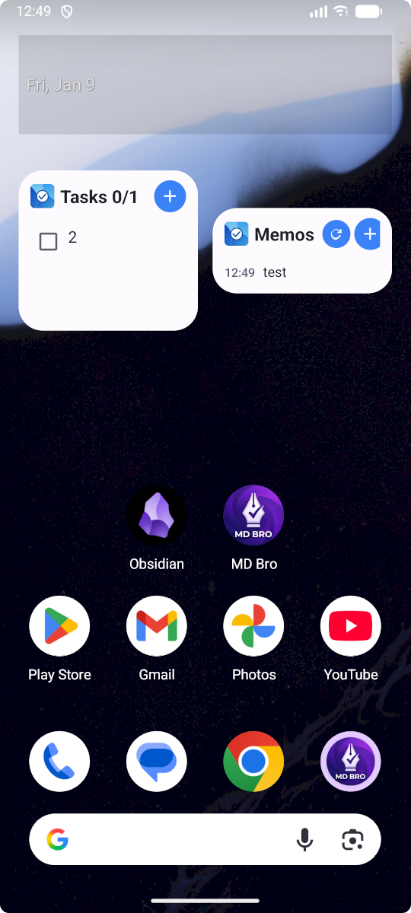
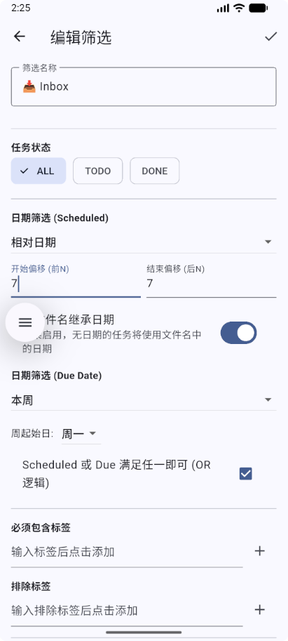

# MD Bro
### Obsidian 的增强型 Android 伴侣

  <b>专注于 Memos 式的短微博记录与增强的任务管理体验</b> 
  本地优先 · 隐私专注 · 完全开源

---

## 📖 简介

**MD Bro** 是一个专为 Obsidian 用户打造的 Android 辅助工具，旨在弥补移动端快速记录和任务管理的短板。它不是要取代 Obsidian 移动端，而是作为一个轻量级、高性能的**伴侣应用**，帮助你更高效地捕获想法和管理代办事项。

本项目 Fork 自 [VaultMate](https://github.com/vankir/VaultMate)，并在其基础上进行了大量针对性的功能增强，特别是引入了类似 **Memos** 或 **Thino** 的碎片化记录体验。

---

## ✨ 核心功能

### 1. 📝 Memos (闪念笔记)
这是 MD Bro 最核心的增强模块，带来流畅的微型博客记录体验：

*   **⚡ 快速捕获**: 
    *   桌面小组件 (Widget) 提供一键添加入口。
    *   点击 `+` 即可弹出透明背景的轻量级输入框，记录灵感无需等待应用完全加载。
*   **⏱️ 自动时间戳**: 
    *   每条记录自动追加 `- HH:mm` 时间戳，完美兼容 Obsidian 日记格式。
    *   支持自定义前缀与时间格式。
*   **🖼️ 图片管理**:
    *   **附件支持**: 直接从相册选择图片作为附件。
    *   **自动压缩**: 内置图片压缩功能，节省仓库体积。
    *   **缩略图预览**: 编辑时直观展示关联图片。
    *   **一键插入**: 点击缩略图即可在光标处插入 `![[]]` 链接。
    *   **文件管理**: 支持直接在 App 内删除图片文件，保持仓库整洁。
*   **✏️ 便捷编辑**:
    *   双击任意 Memo 卡片即可进入编辑模式。
    *   支持修改内容、增删图片链接。
*   **📅 动态路径**:
    *   支持 `{{YYYY}}`, `{{MM}}`, `{{DD}}` 等变量，可根据日期自动将 Memo 归档到指定文件夹或文件（例如 `Daily Notes/2024-01-01.md`）。

### 2. ✅ 增强型任务管理
比原版更强大的 Task 管理能力：

*   **🔍 高级过滤器**: 
    *   支持保存自定义过滤条件（如 ` #todo` + `未完成`）。
*   **📱 桌面小组件**: 
    *   将过滤后的任务列表（如“今日待办”）直接钉在手机桌面。
    *   组件标题会根据过滤条件动态变化，一目了然。

### 3. 🗓️ 日历与导航
*   **时间轴视图**: 以时间轴形式展示每日的 Memos。
*   **日历跳转**: 内置日历选择器，快速回溯历史记录。

### 4. 🔒 安全与隐私
*   **本地优先**: 所有数据直接读写本地 Obsidian 仓库文件，不上传任何云端。
*   **开源透明**: 代码完全开源，你可以审计每一行代码。

---

## 📥 安装与配置

### 设置仓库
1.  **授权访问**: 首次启动时，需授予应用“所有文件访问权限”，以便读写 Obsidian 仓库。
2.  **选择路径**: 在设置中点击“选择仓库路径”，定位到你的 Obsidian Vault 根目录。
3.  **配置 Memos**:
    *   在设置中指定 **Memos 文件路径模式**（例如 `Daily/{{YYYY-MM-DD}}.md`）。
    *   设置 **附件存储路径**。

### 添加桌面小组件
1.  长按 Android 桌面空白处，选择 **小组件 (Widgets)**。
2.  找到 **MD Bro**。
3.  选择 **Memos Widget** 或 **Tasks Widget** 拖拽到桌面。
4.  对于 Tasks Widget，你可以选择预设的过滤器进行展示。

---

## 📸 截图预览

  
  

---

## 🤝 贡献与反馈

欢迎提交 Issue 反馈 Bug 或建议新功能。如果你喜欢这个项目，欢迎提交 Pull Request！

*   **源码地址**: [GitHub](https://github.com/dangehub/md-bro)
*   **原项目**: [VaultMate](https://github.com/vankir/VaultMate)

---

## ⚖️ 许可证
本项目采用 **GNU GPLv3** 许可证。
